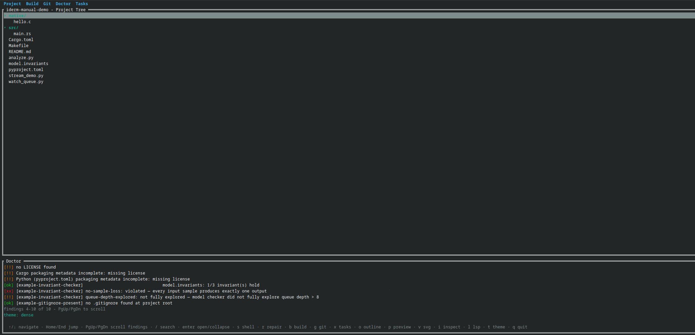
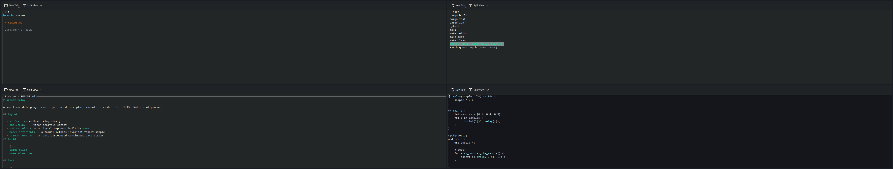
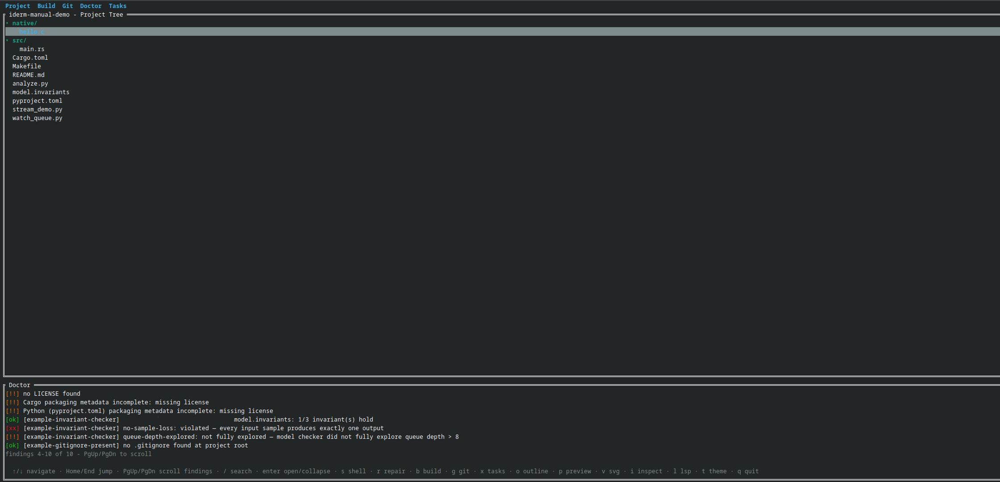
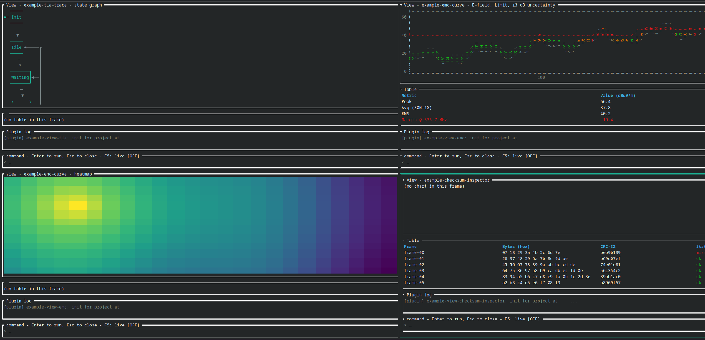
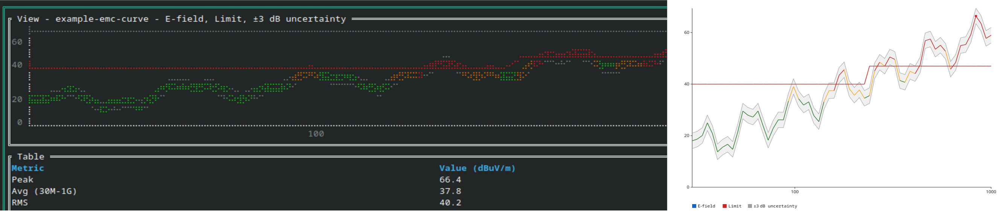

# IDERM quick start guide

IDERM is project intelligence in your terminal.

point it at a repository. it scans the project, runs read-only health checks,
shows the tree, opens your editor, runs project tasks, loads project-local
workbenches, and exposes the same project model through a headless CLI.

this guide gets you from nothing installed to a useful first session.



## 1. before you start

IDERM currently targets linux + macOS on `x86_64` or `aarch64`.
a 24-bit color terminal is recommended.

**windows**: not tested, status differs by path. WSL2 is a real linux
kernel/userspace, so a normal linux build should work there the same
as any other linux terminal -- untested, not expected to need any
code change, just not verified yet. native windows (cmd.exe/PowerShell,
no WSL) is a real open question, not attempted: shell handover (`s`)
reads `$SHELL`, which doesn't exist on windows; embedded Neovim's
`--listen` uses a named pipe there instead of a unix socket; no native
package exists yet (RPM/DEB/Homebrew/AppImage all target linux/macOS).

build-from-source requirements:

- Rust 1.85 or newer
- `cargo`
- `gcc` or `clang`
- Git

optional tools:

| tool | used for |
|---|---|
| Neovim | embedded editor opened with `Enter` |
| `rust-analyzer`, `pylsp`, or `clangd` | on-demand LSP check |
| Git | Git panel |
| Graphviz or Mermaid | rendering headless graph output |

IDERM starts without Neovim, an LSP server, plugins, or network access.

## 2. install

### 2.1 RPM / DNF placeholder

the package repository is not published yet. this is the final shape, not a
command users should run today.

```sh
# PLACEHOLDER — repository URL + package name
sudo dnf config-manager addrepo --from-repofile=<IDERM-RPM-REPOSITORY-URL>
sudo dnf install <IDERM-PACKAGE-NAME>
```

> do not publish this as working installation until CI installs the released
> RPM on a clean supported system.

### 2.2 Homebrew placeholder

the tap is not published yet.

```sh
# PLACEHOLDER — tap + formula names
brew tap <OWNER>/<TAP>
brew install <FORMULA>
```

> replace this only after a clean macOS installation passes from the
> published tap.

### 2.3 build from source: works now

RPM-based linux:

```sh
sudo dnf install -y rust cargo gcc git
```

if packaged Rust is older than 1.85, install it with `rustup` instead.

macOS:

```sh
brew install rust git
xcode-select --install
```

clone + build:

```sh
git clone <IDERM-SOURCE-REPOSITORY-URL>
cd iderm
cargo build --release
```

the binary is `target/release/iderm`.

```sh
./target/release/iderm --help
```

optional user install:

```sh
install -Dm755 target/release/iderm ~/.local/bin/iderm
```

make sure `~/.local/bin` is on `PATH`, then verify:

```sh
iderm --help
```

expected: usage prints and the process exits with status `0`.


## 3. first launch

open the current directory:

```sh
cd <YOUR-PROJECT>
iderm
```

or name it:

```sh
iderm <YOUR-PROJECT>
```

startup is local + read-only:

```text
scan project → run doctor → open workspace
```

scanner looks for build manifests, Git metadata, source languages, and common
project files. multiple build systems can coexist. doctor reports what it
finds; it does not block the workspace.

press `q` or `Esc` from the tree to quit.


## 4. five-minute tour

1. move with `↑` / `↓` or `j` / `k`.
2. select a file + press `Enter` to open it in Neovim.
3. press `g` to inspect Git state.
4. press `x` to inspect derived + project tasks.
5. press `p` on a Markdown file for preview.
6. press `w` to inspect available workbenches.

| key | action |
|---|---|
| `↑` / `↓`, `j` / `k` | move through tree |
| `Enter` | open selected file in embedded Neovim |
| `s` | suspend IDERM + drop to shell |
| `r` | preview repairs; confirm each write with `y` |
| `b` | build tree |
| `g` | Git status |
| `x` | task runner |
| `o` | Rust tree-sitter outline |
| `p` | Markdown preview |
| `v` | SVG viewer |
| `i` | JSON / YAML inspector |
| `w` | workbench picker |
| `l` | background LSP handshake |
| `t` | dense / CRT theme |
| `q`, `Esc` | close panel; quit from tree |

panels close with their own key, `q`, or `Esc`. mouse input is additive;
every mouse action has a keyboard equivalent.



## 5. doctor + repair

doctor runs automatically. it is diagnosis, not mutation.

| marker | meaning |
|---|---|
| `[ok]` | information |
| `[!!]` | review this |
| `[xx]` | error found |

built-in checks cover the basic repository contract: Git, build manifests,
README, license, compile database, and package metadata where applicable.
project-local rules can add domain checks without changing Core.

headless output:

```sh
iderm doctor --json <YOUR-PROJECT>
```

repair is separate:

1. press `r`.
2. read the proposed diff.
3. press `y` to apply, `n` to skip, or `Esc` to cancel.

no repair writes before confirmation.



![Dry-run diff with `[Y]` confirmation visible: a harmless new-file `.gitignore` repair](screenshots/repair.png)

## 6. tasks + live processes

press `x`. IDERM derives tasks from build manifests, then appends project tasks
from `.iderm/tasks.toml`.

one-shot task:

```toml
[[tasks]]
label = "test"
program = "cargo"
args = ["test"]
```

continuous task:

```toml
[[tasks]]
label = "capture sensor"
program = "python3"
args = ["capture_sensor.py", "sensor.analog-capture"]
mode = "continuous"
```

`Enter` runs a one-shot task with terminal handover. `Enter` starts a continuous
task in the background; press it on the same task again to stop. IDERM stops
remaining continuous children when the TUI exits.

root scripts named `stream_<name>.py` or `stream_<name>.sh` are auto-discovered
as continuous tasks. output target is passed as `<name>.analog-capture`.

minimal stream:

```python
#!/usr/bin/env python3
import sys
import time

path = sys.argv[1]

with open(path, "w") as output:
    output.write("time,ch1,ch2\n")
    output.flush()

with open(path, "a") as output:
    tick = 0
    while True:
        output.write(f"{tick},{tick % 10},{(tick * 2) % 10}\n")
        output.flush()
        tick += 1
        time.sleep(0.2)
```

save as `stream_sensor.py`. no `tasks.toml` entry needed.

project tasks are project code. inspect unfamiliar `.iderm/tasks.toml` files +
`stream_*` scripts before running them.

![Derived one-shot tasks, a declared continuous task, and an auto-discovered stream, with `[continuous, running]` on one row](screenshots/task-runner.png)

## 7. plugins + workbenches

plugins are optional + project-local:

```text
.iderm/
├── plugins/          doctor rules
├── repair-recipes/   repair proposals
├── views/            workbenches
├── plugin.toml       optional allowlist
└── tasks.toml        project tasks
```

executable plugins are WASM components. Core checks the versioned WIT ABI.
doctor plugins get read-only host capabilities. repair plugins return
proposals; Core owns validation + confirmation. view plugins return rendering
primitives, not raw terminal control.

standalone doctor rules vendor the WIT interface they build against. each rule
is its own crate + produces one `.wasm`.

```sh
cargo install cargo-component
cd <DOCTOR-RULE-DIRECTORY>
cargo component build --release
mkdir -p <YOUR-PROJECT>/.iderm/plugins
cp target/wasm32-wasip1/release/<RULE>.wasm <YOUR-PROJECT>/.iderm/plugins/
```

restart IDERM. plugin findings join built-in doctor findings.

### open a workbench

1. press `w`.
2. select a view + press `Enter`.
3. type a view command if it accepts one.
4. press `Esc` to return.

| key | action | fallback |
|---|---|---|
| `F5` | live refresh | `Ctrl+l` |
| `F6` / `F7` | slower / faster refresh | `Ctrl+,` / `Ctrl+.` |
| `F8` | add pane; maximum four | `Ctrl+a` |
| `F9` | export focused chart as SVG + TikZ | `Ctrl+e` |
| `Insert` | snapshot focused table | `Ctrl+i` |
| `Shift+F5` | toggle live refresh for every pane | `Ctrl+Shift+l` |
| `Shift+F6` / `Shift+F7` | slower / faster refresh, every pane | `Ctrl+Shift+,` / `Ctrl+Shift+.` |
| `Shift+F10` | snapshot every table | `Ctrl+Shift+i` |
| `Tab` | focus next pane | — |
| `Esc` | close workbench | — |

`q` is text inside a workbench command field. use `Esc` to close. Ctrl
fallbacks cover keyboards that intercept function keys or lack `Insert`.

![Live two-channel analog capture from a real USB audio interface, F5 live indicator `[ON]`, real Table statistics](screenshots/workbench.png)

Source: real hardware, not testbench data. `example-view-analog-capture` has no
cursor command; a visible dropout gap could not be forced deterministically
from live audio timing.





## 8. headless use

TUI + CLI read the same project model.

```sh
iderm scan --format=json <YOUR-PROJECT>
iderm doctor --json <YOUR-PROJECT>
iderm graph --dot <YOUR-PROJECT>
iderm graph --mermaid <YOUR-PROJECT>
iderm ledger record <YOUR-PROJECT> --note "before refactor"
iderm ledger diff <YOUR-PROJECT>
iderm ledger --json <YOUR-PROJECT>
```

use `--help` on the root command or any subcommand.

### run ledger

record before + after a meaningful change, then diff:

```sh
iderm ledger record . --note "before dependency update"
# make + verify the change
iderm ledger record . --note "after dependency update"
iderm ledger diff .
```

### AI adapter

the adapter is optional + model-agnostic. configure `.iderm/ai.toml`. it gets
read-only project state through the headless interface.

```sh
iderm ai explain <YOUR-PROJECT>
iderm ai repair <YOUR-PROJECT>
iderm ai repair <YOUR-PROJECT> --apply
iderm ai test <YOUR-PROJECT>
```

`ai repair` without `--apply` proposes only. applying still uses the repair
validation path. inspect configuration, data handling + proposed diff before
enabling writes.

the configured command needs trust approval first -- run it once
interactively, or `iderm trust <YOUR-PROJECT>` ahead of a headless/CI
invocation, since there's no terminal to prompt on there.

## 9. trust boundary

opening a normal project scans local files. it does not need the network.

these actions execute project-declared code or tools:

- opening a project with executable `.iderm` plugins
- running a task with `x`
- running an `iderm ai` command
- opening files through an external editor or language server

plugins run inside the WASM capability boundary. tasks + external tools are
native processes. subprocesses use argv arrays, not shell-string expansion,
but the program is still code chosen by the project.

a declared task (`.iderm/tasks.toml`, an auto-discovered `stream_*` script,
or the `tasks`/`lsp_binary` of a project-local `.iderm/languages/*.toml`) or
the `iderm ai` command (`.iderm/ai.toml`) needs your approval before it runs
the first time, and again after any later edit to the declared file --
`iderm trust <path>` approves ahead of a scripted or CI run. a task or LSP
handshake derived from a bundled language manifest (`cargo build`, `make
test`, `rust-analyzer`, ...) isn't gated -- the program there is fixed by
iderm itself, not read from the project.

for a repository you do not trust:

1. inspect `.iderm/`.
2. inspect root `stream_*.py` + `stream_*.sh` files.
3. inspect build manifests before running tasks.
4. remove or restrict plugins with `.iderm/plugin.toml`.
5. use headless `scan` before the full workspace if needed.

## 10. common problems

### `iderm: command not found`

run `./target/release/iderm`, or add `~/.local/bin` to `PATH`.

### `Enter` does not open an editor

install Neovim + confirm `nvim --version` works from the same shell.

### LSP check reports no server

install the server for the detected language. IDERM does not install it.

### no tasks appear

confirm a supported build manifest, `.iderm/tasks.toml`, or root
`stream_<name>.py` / `.sh` exists.

### a plugin does not load

check:

- `.wasm` is in the correct `.iderm` directory
- `.iderm/plugin.toml` allows it
- its `iderm:plugin` ABI version is compatible
- it is component-model WASM, not a plain WASI module

plugin failures become named doctor findings. one bad plugin does not abort the
remaining checks.

### live view is flat or stale

confirm its task says `[continuous, running]`, the capture file is growing,
and live refresh is on with `F5` / `Ctrl+l`.

### function keys do nothing

use the Ctrl fallback. some terminals + laptops consume the bare F-key row.

### `PageUp` / `PageDown` do nothing in the doctor panel

confirmed on macOS: laptop keyboards send `PageUp` / `PageDown` as `fn+Up` /
`fn+Down`, and some terminal apps do not translate that combination into the
escape sequence IDERM expects, so no event reaches it at all -- unlike the
function-key case above, there is no in-app fallback chord for this one.
workaround: remap `fn+Up` / `fn+Down` (or any spare combination) to send real
`Page Up` / `Page Down` at the OS or terminal level -- macOS System Settings
> Keyboard > Keyboard Shortcuts, or a remapper such as Karabiner-Elements,
or the terminal app's own key-binding settings if it exposes one.

## 11. update + remove

source update:

```sh
cd <IDERM-SOURCE-CHECKOUT>
git pull
cargo build --release
install -Dm755 target/release/iderm ~/.local/bin/iderm
```

remove the user binary:

```sh
rm ~/.local/bin/iderm
```

project configuration + state live inside that project's `.iderm/` directory.
inspect it, then remove it if you want the project-local integration gone.

## 12. next reads

| need | document |
|---|---|
| complete manual | `docs/manual/index.md` |
| architecture, modules, headless interface, config, doctor, plugin ABI, rendering, AI adapter | `docs/reference/Architecture_Compact.md` |
| decisions + current behavior | `docs/reference/Decisions_Compact.md` |
| roadmap + what's not planned | `docs/reference/Roadmap_Compact.md` |
| security posture + real verification results | `docs/reference/Security_Reports_Compact.md` |
| project vision | `docs/reference/Vision_Compact.md` |
| workbench guides | `docs/reference/Plugin_Guides_And_Misc_Compact.md` |

Every entry above is a compact index, not the full prose original -- Core's
full-detail docs live in Core's own repository.

IDERM is dual-licensed under MIT or Apache-2.0, at your option.
