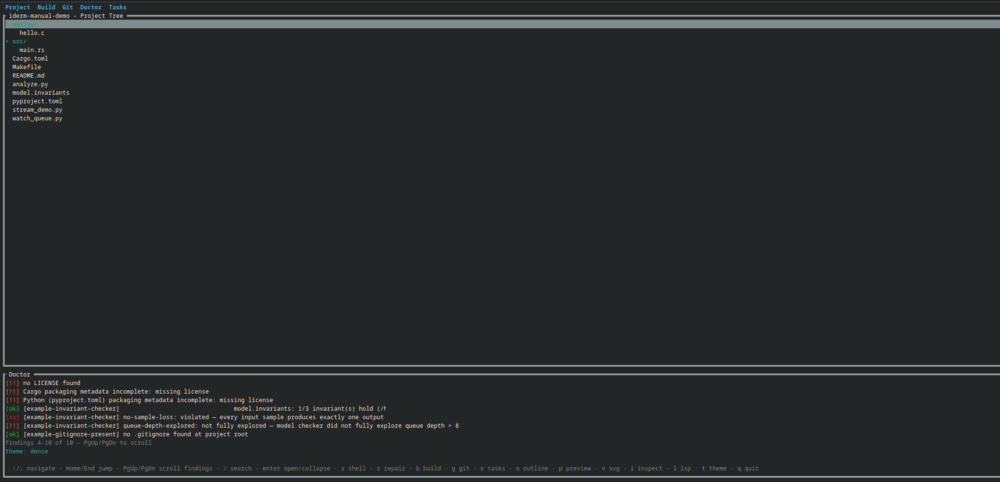
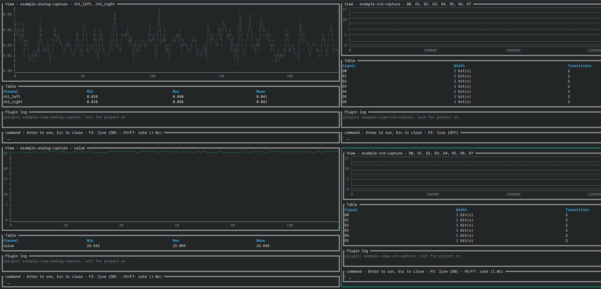

# 2. Operation

| Field | Value |
|---|---|
| Document type | User manual, Clause 2 |
| Part of | [Index](index.md) |

## 2.1 Start and stop

```sh
iderm
iderm <project-path>
```

An omitted path selects the current directory. `q` or `Esc` exits from the tree
view. IDERM restores terminal mode after normal exit and after a handled panic.

## 2.2 Tree view

| Key | Function |
|---|---|
| `Up`, `Down`, `j`, `k` | Move selection |
| `PageUp`, `PageDown` | Scroll Doctor findings |
| `Home`, `End` | Select first or last tree item |
| `/` | Search tree text |
| `Enter` | Activate selected file |
| `s` | Hand terminal to `$SHELL` |
| `r` | Open Repair |
| `b` | Open build tree |
| `g` | Open Git status |
| `x` | Open task list |
| `o` | Open outline for selected Rust file |
| `p` | Preview selected Markdown file |
| `v` | View selected SVG file |
| `i` | Inspect selected JSON or YAML file |
| `w` | Open workbench picker |
| `l` | Start background LSP handshake |
| `t` | Toggle dense and CRT themes |
| `q`, `Esc` | Close or exit |

Mouse selection and menu actions are optional equivalents. Keyboard access is
retained for every mouse action.

`PageUp` and `PageDown` reach IDERM as physical key events. On some laptop
keyboards these keys exist only as `fn+Up` / `fn+Down`, and some terminal
applications do not translate that combination into the expected escape
sequence, so no event is delivered and scrolling has no effect. This case has
no in-app fallback chord. Workaround: remap `fn+Up` / `fn+Down` to send real
`Page Up` / `Page Down` at the operating-system or terminal level.



## 2.3 Editor and shell handover

`Enter` starts `nvim --listen <temporary-socket> <file>`. Neovim receives the
terminal directly. IDERM probes the same instance through msgpack RPC. The
probe is non-fatal. User Neovim configuration is loaded by this interactive
path.

`s` starts the user's `$SHELL`, or `/bin/sh` when `$SHELL` is absent. IDERM
suspends its terminal mode during either handover and resumes afterward.

## 2.4 Git, build, and task panels

The Git panel invokes the system `git` executable with `git -C <project>`. It
shows the current branch and `git status --short` output.

The build panel uses detected manifests and `compile_commands.json`. The task
panel contains manifest tasks, discovered CMake or Make tasks, auto-discovered
`stream_*` scripts, and `.iderm/tasks.toml` tasks.

A one-shot task receives terminal handover. A continuous task runs in the
background. `Enter` toggles a continuous task. Remaining continuous child
processes are terminated when IDERM exits.

## 2.5 Workbench operation

| Key | Function | Alternative |
|---|---|---|
| `F5` | Toggle focused live refresh | `Ctrl+l` |
| `F6`, `F7` | Decrease or increase interval | `Ctrl+,`, `Ctrl+.` |
| `F8` | Add pane | `Ctrl+a` |
| `F9` | Export focused figure | `Ctrl+e` |
| `Insert` | Snapshot focused table | `Ctrl+i` |
| `Shift+F5` | Toggle all live panes | `Ctrl+Shift+l` |
| `Shift+F6`, `Shift+F7` | Decrease or increase interval, all panes | `Ctrl+Shift+,`, `Ctrl+Shift+.` |
| `Shift+F10` | Snapshot all tables | `Ctrl+Shift+i` |
| `Tab` | Select next pane | None |
| `Esc` | Close workbench | None |

A workbench accepts text commands. Therefore `q` is input and shall not close
the workbench. Up to four panes may be open. The refresh interval is bounded
by implementation limits; the minimum is 100 ms.



## 2.6 Headless commands

```text
iderm scan --format=json [path]
iderm doctor --json [path]
iderm ledger record [path] [--note "..."]
iderm ledger diff [path]
iderm ledger --json [path]
iderm graph --dot [path]
iderm graph --mermaid [path]
iderm ai repair [path] [--apply]
iderm ai explain [path]
iderm ai test [path]
```

`scan`, `doctor`, and ledger JSON use versioned envelopes. The current schema
version is `0.1.0`. Root paths are canonicalized when possible. Graph commands
write DOT or Mermaid text to standard output. Supplying both graph formats is
an error.

## 2.7 Run Ledger

`ledger record` writes one JSON object to `.iderm/run-ledger.jsonl`. It is the
only ledger command that creates or appends state. `ledger diff` compares the
two latest records. It shall fail when fewer than two records exist. The ledger
records state. It does not record actions and cannot replay them.
