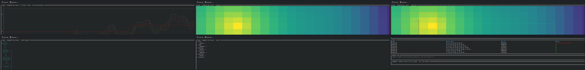

# 4. Configuration and plugins

| Field | Value |
|---|---|
| Document type | User manual, Clause 4 |
| Part of | [Index](index.md) |

## 4.1 Configuration rule

Configuration is project-local and additive. An absent file disables only the
related extension. It shall not prevent the base operating loop.

| Path | Function | Commit policy |
|---|---|---|
| `.iderm/plugins/*.wasm` | Doctor rules | Project decision |
| `.iderm/views/*.wasm` | Workbenches | Project decision |
| `.iderm/repair-recipes/*.wasm` | Repair proposals | Project decision |
| `.iderm/plugin.toml` | Plugin allowlist | Commit |
| `.iderm/languages/*.toml` | Additional language manifests | Commit |
| `.iderm/tasks.toml` | Additional tasks | Commit |
| `.iderm/ai.toml` | External AI command | Commit only when secret-free |
| `.iderm/run-ledger.jsonl` | Local run history | Do not commit |
| `.iderm/exports/` | Generated figures | Do not commit |

Malformed optional configuration is generally skipped or treated as empty.
This behavior prevents optional configuration from disabling Core. It may also
hide a configuration error. The user should validate changed TOML files.

Recommended ignore entries:

```gitignore
.iderm/run-ledger.jsonl
.iderm/exports/
```

## 4.2 Tasks

`.iderm/tasks.toml` contains repeated task tables:

```toml
[[tasks]]
label = "verify"
program = "cargo"
args = ["test"]
mode = "one_shot"
```

`mode` may be `one_shot` or `continuous`. The default is `one_shot`.
`program` and `args` are passed as an argv array. Shell interpolation is not
performed unless the declared program is itself a shell.

## 4.3 Language manifests

Default manifests are embedded for Rust, Go, TypeScript or JavaScript, Python,
CMake, and Make. First-party manifests for LaTeX, TLA+, Promela, Murphi, and
Fortran are available but not active by default. Activate one by copying its
TOML file from `languages/` into `.iderm/languages/`.

Detection uses an exact root filename or a non-recursive glob over root files.
A project-local manifest may define an LSP binary, tree-sitter grammar, fixed
tasks, and one supported dynamic-task mode.

## 4.4 Plugin kinds

| Kind | Directory | Contract |
|---|---|---|
| Doctor rule | `.iderm/plugins/` | Return findings |
| Repair recipe | `.iderm/repair-recipes/` | Return new-file proposals |
| View provider | `.iderm/views/` | Return view state and primitives |

The current ABI package is `iderm:plugin@0.4.0`. A plugin with an incompatible
major version is rejected before execution.

## 4.5 Allowlist

When `.iderm/plugin.toml` is absent, all matching WASM files in the three
plugin directories are discovered. When present, only named files are active.
The arrays are `doctor_rules`, `views`, and `repair_recipes`.

```toml
doctor_rules = ["rule.wasm"]
views = ["view.wasm"]
repair_recipes = ["repair.wasm"]
```

## 4.6 Runtime boundary

A plugin has no preopened directory, environment, argument, or network access.
Host capabilities are `read-file`, `list-files`, and `log`. File reads and glob
results are constrained to the canonical project root.

Each plugin call has a nominal wall-clock budget of 2 s and a linear-memory
limit of 256 MiB. A timeout or trap is reported as a plugin error. See Clause
11 for the complete security model.

## 4.7 View primitives

The ABI provides `xy-chart`, `heatmap`, `table`, `state-graph`, `trace`, and
`composed` primitives. A view plugin cannot emit raw terminal control through
the view interface.



## 4.8 AI configuration

`.iderm/ai.toml` names an external command and argv values. Core sends scan and
Doctor JSON to standard input and reads standard output. Credentials should be
provided through the external command's normal environment or credential
store. Secrets shall not be committed in TOML.
