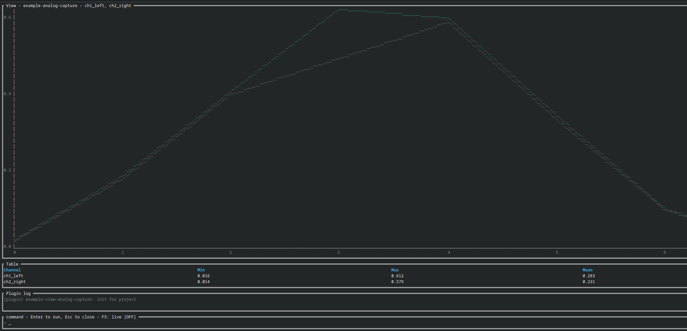

# 5. Hardware and instrumentation

| Field | Value |
|---|---|
| Document type | User manual, Clause 5 |
| Part of | [Index](index.md) |

## 5.1 Principle

IDERM reads measurement output. It does not provide direct device-control
capabilities to plugins.

## 5.2 Data path

```text
instrument or emulator -> native project task -> capture file -> WASM reader -> view
```

The native task is outside the WASM sandbox. It may access hardware, the
network, vendor tools, or operating-system interfaces according to its own
permissions. The plugin may read only project-root files through Core.

## 5.3 Digital capture

The digital capture reader accepts VCD data based on IEEE 1364 and IEEE 1800
value-change syntax. It supports:

- scalar `0`, `1`, `x`, and `z` changes;
- binary vectors;
- `$var`, `$timescale`, `$enddefinitions`, and dump commands; and
- flat signal names.

Scope hierarchy is not retained. Real-number values are stored as opaque text.
The reader is not a complete VCD conformance implementation.

## 5.4 Analog capture

An analog capture is comma-separated text:

```csv
time,ch1,ch2
0.0,0.0,1.0
0.2,0.4,0.9
0.4,,0.7
```

The first column is numeric time. At least one channel is required. Every data
row shall have the header column count. Empty channel cells and case-insensitive
`nan` values represent missing samples. A non-numeric time or other sample is
an error.

The parser treats the first header field as display text. It does not infer or
convert units.

## 5.5 Continuous capture

A continuous capture tool should append complete rows and flush output after
each update. It may be declared in `.iderm/tasks.toml` with
`mode = "continuous"`. A root `stream_<name>.py` or `.sh` file is discovered
automatically and receives `<name>.analog-capture` as its output argument.

Core creates one UTC-stamped log per continuous-task run under
`logs/<task-slug>/`. Logging failure does not prevent the task from starting.

## 5.6 Network instruments

A plugin has no network capability. A project may declare a native bridge that
queries a network instrument and writes a capture file. The bridge, protocol,
credentials, timeout, and device safety are project responsibilities.

## 5.7 Testbench data

Testbench emulators may exercise the complete capture, Doctor, and view path.
Synthetic data shall be identified as synthetic or testbench data. It shall not
be represented as a physical measurement.




## 5.8 Prohibited assumption

Read-only plugin access does not make a native capture task safe. A task can
control a device if the declared external program can do so. The user shall
inspect task definitions and bridge scripts before execution.
